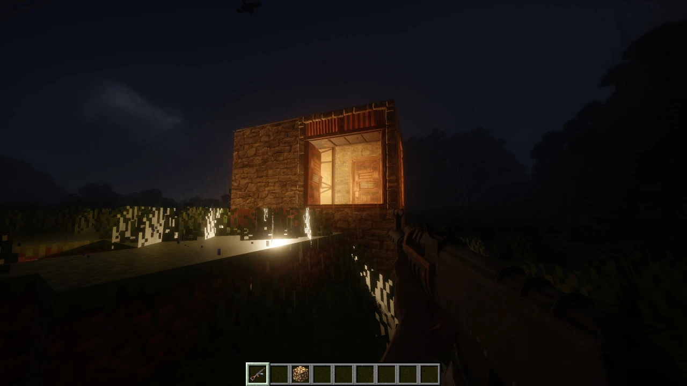
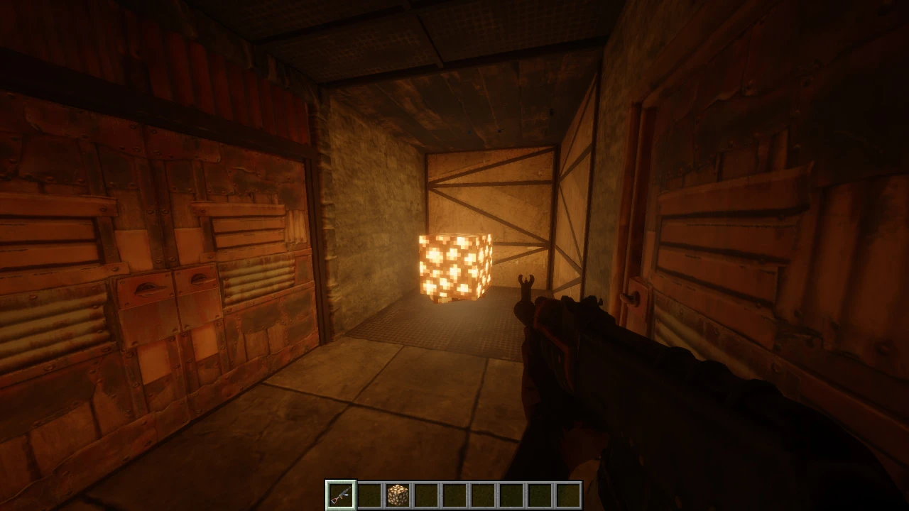
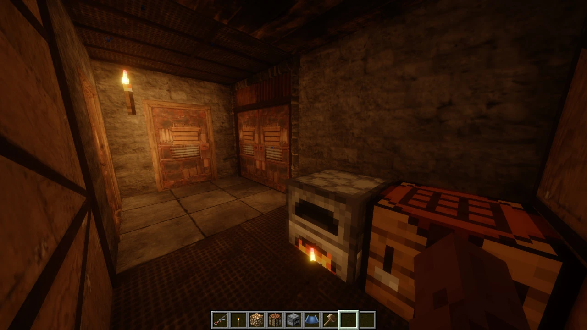

# Rust in Minecraft

Facepunch's **Rust** inside **Minecraft 1.21.11** (Fabric): the guns, the building system, doors, stability and raiding, with Rust's own models, animations and sounds.

> **Early release.** Everything below works in singleplayer; multiplayer has not been tested yet.

  
  

  

Shown with a shader pack running through Iris.

**No Rust content is distributed here.** The installer builds the mod's assets on your PC from *your own* copy of Rust. See [How it works](#how-it-works).

---

## Features

### Weapons
- **Assault Rifle**, **Semi-Automatic Rifle**, **Semi-Automatic Pistol** and **Rocket Launcher**, with Rust's first-person animations, recoil, muzzle flashes, reloads and sounds.
- Rust's player model and animations for you and other players.
- Rocket splash damage with Rust's falloff.

### Building
- **Building Plan** with Rust's pie menu and **17 pieces**: square and triangle foundations and floors, walls, window walls, doorways, half walls, low walls, wall frames, square and triangle floor frames, square and triangle roofs, foundation steps, L Stairs and U Stairs.
- Rust's socket snapping: pieces click onto each other the way they do in Rust.
- Roof corners and wall shapes adapt to neighbouring pieces; diagonal wall cuts use matching rendering, collision and destruction shapes.
- Foundation steps attach to exposed foundation sides as well as square top attachments. Interior L and U stairs attach to square foundations and floors, with quarter-turn placement.
- **Hammer**: swing to repair, hold right-click for the pie menu to upgrade (twig → wood → stone → sheet metal → armored), rotate or demolish. With the hammer in hand, aim at a piece to see its stability and health.
- **Stability**: ported from Rust. Every piece shows `% STABLE`; remove a foundation and what stood on it collapses.
- **Health and raiding**: bullets and rockets damage building pieces and doors through each tier's real protection values.
- Aligned walking surfaces and continuous slope contact for roofs and stairs. Crouching holds at exterior edges while leaving floor-frame openings usable.
- Destruction fragments follow the visible building sections, land on world/building surfaces, shrink and disappear after resting.

### Doors
- Single and double doors, wood and sheet metal, in doorways and wall frames.
- Rust's open/close animations and sounds. Tap **E** to open or close, hold **E** for the pie menu (open/close, knock).
- **Code Locks** on single and double doors: master and guest codes, an on-screen keypad, access lists, lock/unlock and removal through the pie menu, and shock/temporary lockout after repeated wrong codes. Codes are kept on the server.

### Movement
- **Shift** to sprint and **Ctrl** to crouch by default. Existing custom bindings stay editable.
- Ground movement uses Rust's walk, run and crouch speed targets. Running requires held forward/sprint input and stops while crouching, aiming or firing; Minecraft's acceleration and movement effects still apply.

### Decorating
- Place **any Minecraft block** freely inside your base, with a live hologram of the block you hold.
- Torches go anywhere on a wall, and give real light.

### Atmosphere
- Buildings are lit like part of the world: per-vertex light, sky occlusion, baked normal maps.
- Rain and snow stop at your roof, and sounds are muffled when a wall is between you and the source.
- Works with **Iris + Sodium** shader packs (buildings fall back to a shader-friendly render path).

All items are in the **Rust in Minecraft** creative tab. English and Russian interface.

## Controls

| Action | Control |
| --- | --- |
| Fire / swing hammer / place piece | Left mouse |
| Aim down sights (weapons) | Right mouse |
| Pie menu (Building Plan, Hammer) | Hold right mouse |
| Rotate a piece (Building Plan) | `R` |
| Reload | `R` |
| Sprint | Hold `Shift` while moving forward |
| Crouch | `Ctrl` |
| Open / close a door | Tap `E` |
| Door / code-lock pie menu | Hold `E` |
| Place a held door or code lock | Left mouse |
| Enter a code | Number keys or click the keypad |

## Requirements

- Windows
- **Rust** installed (Steam)
- Minecraft **1.21.11** with [Fabric Loader](https://fabricmc.net/use/installer/) 0.17.3 or newer
- About 4 GB of free RAM and 3 GB of free disk space while building

## Install

1. Download `RustInMinecraft-Installer.exe` from [**Releases**](../../releases/latest).
2. Close Rust, then run the installer. Your Rust folder is found automatically, otherwise pick it.
3. Choose where to save the result and press **Build the mod**. It takes about 5 minutes on a fast PC, up to 40 on a slow one.
4. Put **both** jars from the output folder (`rust-in-minecraft-*.jar` and `fabric-api-*.jar`) into your Minecraft `mods` folder.
5. Start Minecraft with the Fabric 1.21.11 profile.

> Windows SmartScreen may warn about the installer because it is not code-signed: choose *More info → Run anyway*. Some antivirus programs also flag unsigned Python-based installers; the installer only reads your Rust folder and writes to the folder you choose.

## How it works

The mod's code is separate from Rust's content. The installer reads the models, textures, animations and sounds from your own Rust install, converts them for Minecraft, and packs them into the mod on your computer. Nothing from Rust is downloaded or included in this repository or in the installer.

**Do not share the jar the installer produces:** it contains Facepunch's content and is for your own use only.

## Disclaimer

Rust and its content belong to Facepunch Studios. This project is an unofficial fan project and is not affiliated with or endorsed by Facepunch Studios or Mojang Studios.

## Source code

The Minecraft mod's source is in [`mod/`](mod) (Fabric, Java 21). The installer is not open source.

Building it with `./gradlew build` gives a jar **without Rust's content**: the models, textures, animations and sounds
only come from the installer, built from your own copy of Rust. For playing, use the installer from
[Releases](../../releases/latest).

## License

Copyright © 2026 misterbobrust. The mod's source code is licensed under the
[PolyForm Noncommercial License 1.0.0](LICENSE.txt): you may use, study, modify and share it for any noncommercial
purpose. Commercial use (for example on a paid or monetised server) needs a separate licence; contact misterbobrust.

The licence covers only this project's own code and resources, not Rust's content, which belongs to Facepunch Studios.

### Contributing

Pull requests are welcome. By submitting a contribution, you grant misterbobrust a perpetual, worldwide,
irrevocable licence to use, modify, sublicense and relicense it, including commercially.
